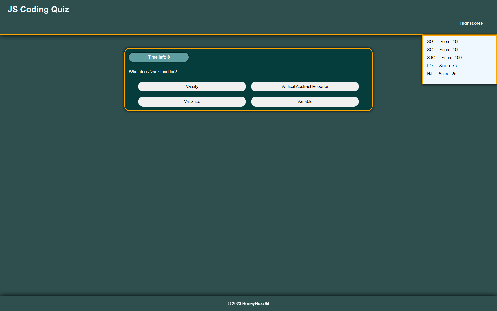

# JavaScript Coding Quiz

## Description

This project was created to push my skills as a coder and develop a simple coding quiz challenge using a variety of techniques. For this project I had to utilize HTML classes to their fullest, responsive CSS styling, and dynamic JavaScripting that enabled a more novel experience for users. Local storage and jQuery were relied upon heavily to support this project.

This simple coding quiz gives users the opportunity to quickly test on their JS knowledge. This project serves as a framework that can be expanded with additional questions or content.

## Usage

This project is live and can be accessed at the following link: https://honeybuzz94.github.io/secure-password-generator/

Anyone is welcome to use or duplicate this project as they would like. High scores are only saved to the user's local storage and are not shared with others.

## Credits

Collaborators:

* Valarie Grow

The following resources were used to assist with the development of this project:

* Grant Weatherson's article on [freedcodecamp.org](https://www.freecodecamp.org/news/how-to-shuffle-an-array-of-items-using-javascript-or-typescript/), "How to Shuffle an Array of Items Using JavaScript or TypeScript" was used and referenced when creating the question shuffler for this project.
* James Q Quick's video on [YouTube.com](https://www.youtube.com/watch?v=DFhmNLKwwGw), "Build a Quiz App (8) - Save High Scores in Local Storage" was referenced when creating the function that logs highscores to local storage.
* The [jQuery](https://jquery.com/) API was used for this project.

---